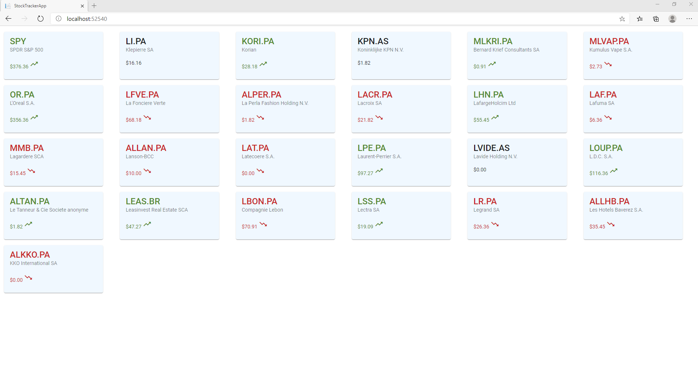

# StockTracker
StockTracker is a full stack application show real time price update 

- Frontend:
  - Angular 9

- Backend:
  - Asp.net core 3.1 
  - SignalR Core 
  - EF Core
 
 To simulate a real-time price flow from the server, i create a Hosted Service to generate random prices and send to the client. 
  

